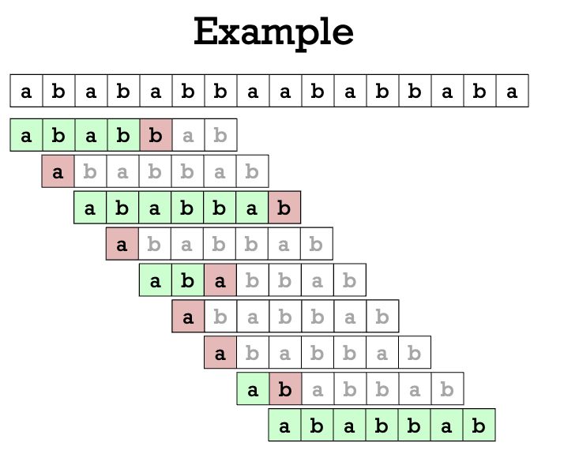

# {frontMatter.title}

The task is very simple. You are given a long text $T[1..n]$ and a pattern $P[1..m]$.
The goal is to find all occurrences of $P$ inside $T$ as a **substring**.

## Naive Algorithm

## Knuth-Morris-Pratt (KMP) Algorithm

The KMP Algorithm computes a **prefix** function $\mathit{prefix}[i]$ of the text.

### The `next()` Function

Given the pattern $P[1..m]$.
Let `next(i)` be the number that corresponds to **the length of the longest proper prefix** of $P[1..i]$ that is also a suffix of $P[1..i]$.

| i | 1 | 2 | 3 | 4 | 5 | 6 | 7 |
|---|---|---|---|---|---|---|---|
| P | `a` | `b` | `a` | `b` | `b` | `a` | `b` |
| `next(i)` | 0 | 0 | 1 | 2 | 0 | 1 | 2 |

{/* 
## Z-Function

$Z$ function is different from the prefix function.
$Z[i]$ is defined to be the longest common prefix of the given string and the ``suffix of that string starting from the $i$-th character''.

## Extensions

High level intuition: usually there are some collection of **texts** $\mathcal{T}=\{T_1, T_2, \ldots, T_k\}$ and some **patterns** $\mathcal{P}=\{P_1, P_2, \ldots, P_\ell\}$.
The goal for the exact pattern matching algorithms would be to find/detect if a pattern occurs in the text.
In this section we focus on the **find all occurrences** problem:

For each pattern $P_j$, the goal is to find for all $i$, the locations where $P_j$ appears in $T_i$.

## Four Settings

* One text, one pattern.
* Multiple texts, one pattern.
* One text, multiple patterns.
* Multiple texts, multiple patterns. */}

## References

* https://cp-algorithms.com/string/prefix-function.html 
* https://liuzhenglaichn.gitbook.io/algorithm/string/kmp

